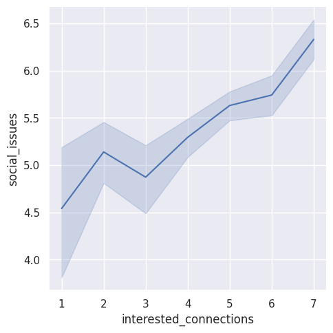
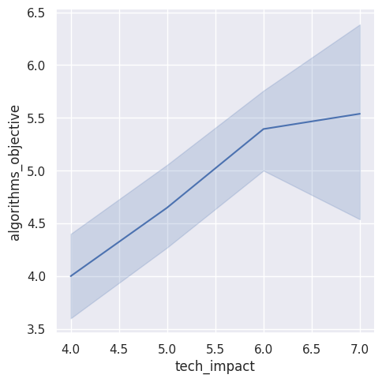
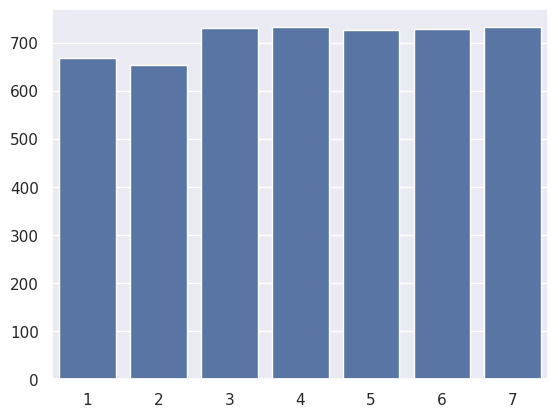

---
# Do not edit the text between these lines!
layout: default
---

# Welcome to Maggie's ex09!

<!-- This is a comment. Below, you'll see code for inserting an image. To make this image appear, update <custom-path>. To add an image, save it inside the imgs folder of this repository. -->

I recommend that the COMP110 course includes at least one lesson concerning the ethics of computer science. Ethics in computer science can look like many different things. Some examples might be conducting ethical research using computer science or discussing the ethics of AI use. 

## Analysis 1

My first analysis compared the interest in intersection of computer science and other fields and the belief that social issues are relevant to computer scientists. There was a positive correlation between the two, showing that as students showed strong interest in the intersection of computer science and other fields, that they would also be more likely to believe that social issues are relevant to computer scientists. While this could be due to a confounding variable, it does show that students who are interested in interdisciplinary applications of computer science might be concerned with the ethical ramifications of those applications. 

## Analysis 2

My second analysis compared the belief that algorithms are objective agains the belief that technology impacts our society. The line shows linear growth until ratings reach 5.0, in which the slope decreases. There is more spread as the belief that technology impacts society increases. I chose to plot these two against each other because the objectivity of algorithms is an important question in research ethics, especially within computer science. I wanted to see if, as the belief that technology impacts society increased, the belief that algorithms were objective would decrease. This is not exactly what I found. While the growth decreased, the line itself consistently increased. 

## Analysis 3

My third analysis shows the counts of each rating of the statement "Social issues are relevant to computer scientists and software engineers." This analysis is also very inconclusive. There are close to even numbers of each rating, although there is a slight skew left, indicating that the mean response will be slightly greater than the median response. This could indicate that students do believe that social issues are relevant to computer scientists. I chose to analyze this because, as I have mentioned previously, social issues include ethical issues. 

## Conclusion

I believe it would be most beneficial to begin with a small-scale implementation of this proposal. One lesson would be a good start. After the course, students should be asked how they felt about the ethics lesson and whether or not more lessons on ethics should be included. They could also be asked about their favorite lessons or topics, and ethics could be included as an option. Then, analysis could be performed on the responses to determine if students found the topic to be valuable or not. Hopefully, this would show either a negative (if students did not indicate favoritism towards the lesson/indicate that they enjoyed the lesson) or a positive (if students indicate favoritism towards the lesson/indicate that they did enjoy the lesson). 

A significant cost to this would be the usage of class time. It can be difficult to get through an introductory course and cover as much as needs to be covered in such a short span of time, and dedicating significant time to the discussion of ethics might cause problems in the schedule. It might take away from another topic that could be just as useful. Further data could be collected to discover what students and instructors think is the least useful topic, and that could be replaced with ethics. This cost is also an example of a trade-off. Some other topic must be discarded in order for an ethics topic to be inserted. A negative impact on a stakeholder could be the time it would take for an instructor to implement a lesson on ethics. It is assumed that the instructor has most expertise in the field of computer science, but it might take outside input from an ethics expert to create the best possible lesson. This would take up some resources that might otherwise be used on improving other aspects of the course. For these reasons, a "pilot" implementation with one lesson and one LS exercise would be most beneficial in the short term. This would introduce students to the topic while also allowing instructors to exert relatively little effort to increase stakeholder value. 